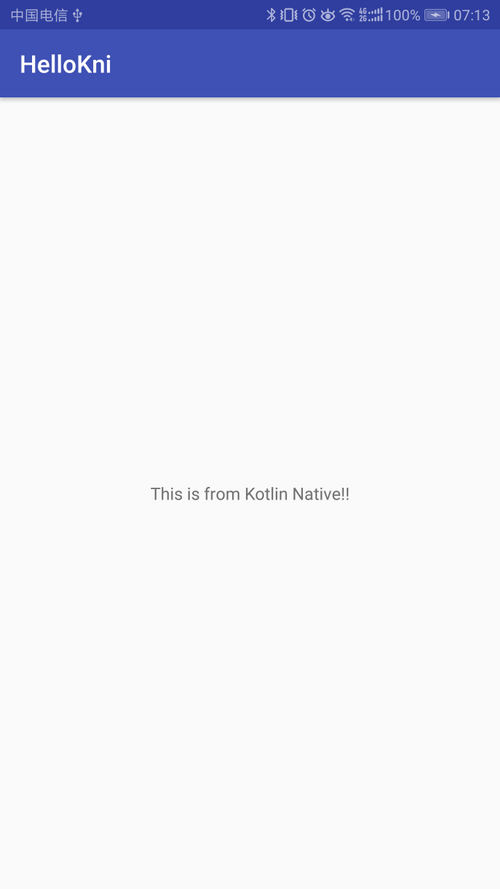
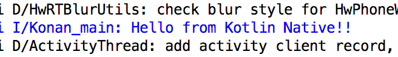

Hello KNI
=========

修改 Google 官方 Jni 例子，加入对 Kotlin Native 生成的动态库的调用。

### 示例内容

除了 Objective-C 以外，目前 Kotlin Native 只能通过 C 来与其他语言交互，这一点也可以参照 Kotlin Native 官方的 Python 例子。为了让 Java 能够链接到 Kotlin Native 的函数，我们需要通过 `CName` 注解来显式的声明，例如：

```kotlin
@CName("Java_com_example_hellojni_HelloJni_stringFromJNI")
fun stringFromJNI(env: CPointer<JNIEnvVar>, thiz: jobject): jstring {
    memScoped {
        return env.pointed.pointed!!.NewStringUTF!!.invoke(env, "This is from Kotlin Native!!".cstr.ptr)!!
    }
}
```

示例简单演示了：

* 如何在 Kotlin Native 中使用 Android 日志系统输出日志
* 如何返回 Java String 类型
* 如何调用 Java 方法

### 构建步骤

直接运行 app 即可，依赖已经在 Gradle 当中配置好。

### 运行结果

运行截图：



日志输出：

